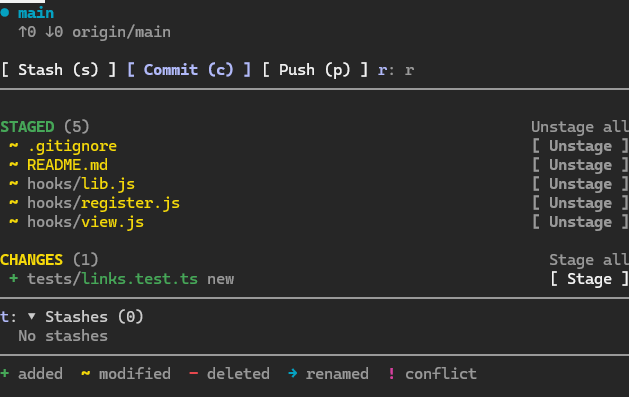
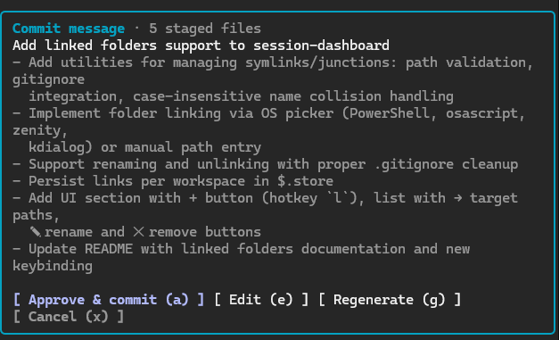
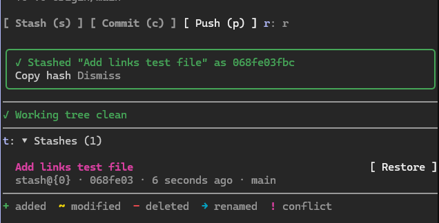
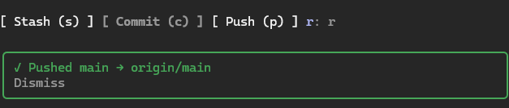

# git-mod

A `/git` side panel for Claude Code. Tested with Claude Code 2.1.289 on Windows 11.



## Install

From the marketplace (inside Claude Code):
```
/plugin marketplace add netgfx/claude-git-mod
/plugin install git-mod@claude-git-mod
```
Or from a shell:
```bash
claude plugin marketplace add netgfx/claude-git-mod
claude plugin install git-mod@claude-git-mod
```
Restart Claude Code (or run `/reload-plugins`), then type `/git`.

To update later: `claude plugin marketplace update claude-git-mod`.

## Features

- **Branch header**: shows the current branch. For a branch with a group, like `feature/login-form`, it also shows the group tag and the branch it came from (`↳ from develop`). Shows ahead/behind (`↑2 ↓0`) against the upstream.
- **Staged / Changes lists**: `+` added (green), `~` modified (yellow), `-` deleted (red), `→` renamed (cyan), `!` conflict (magenta). Each file has a **Stage** or **Unstage** button. There are also **Stage all** and **Unstage all** buttons.
- **Open a file**: double-click a file name in either list, or move to it with Tab / the arrows and press Enter. The file opens in the app your system uses for that file type (Windows: its file association; macOS: Launch Services; Linux: `xdg-mime`). If that app is VS Code (or VS Code Insiders, VSCodium, Cursor, Windsurf), Sublime Text or Notepad++, the file opens at its first changed line: the first hunk of `git diff` for the Changes list, `git diff --cached` for the Staged list. Deleted files can't be opened. A single click does nothing, so a click by mistake doesn't open anything.
- **Commit (c)**: the model (`haiku`) writes a message from the staged diff and your recent commit style. You can then **Approve & commit (a)**, **Edit (e)**, **Regenerate (g)** or **Cancel (x)**. In edit mode, separate body lines with `|`.
- **Pull (l)**: runs `git pull --ff-only` from the upstream and says how many commits came in. It never creates a merge commit or rebases; if the branches have diverged it stops and tells you, so you can choose `git pull --rebase` or `--no-rebase` yourself. Shows `↓N` when the branch is behind.
- **Push (p)**: runs `git push`. If the branch has no upstream yet, it runs `git push -u origin <branch>`.
- **Stash (s)**: runs `git stash push -u` (untracked files included). The model writes a title of up to 6 words. The panel shows the stash commit hash, with a **Copy hash** button.
- **Stashes (t)**: a collapsible list. Each stash has a title, ref, hash, age, and **Restore** and **Remove** buttons. Restore runs `git stash apply`, so the stash stays in the list. **Remove** asks you to confirm (**Confirm remove** / **Keep**), then runs `git stash drop`. The notice shows the dropped stash's hash, with a **Copy hash** button, so you can bring it back with `git stash store -m "<title>" <hash>`.

### Screenshots

AI-written commit message, waiting for approval:



Stash with an AI title, and the stash list with a Restore button:



Push result:



### Keys

| Key | Action |
| --- | --- |
| `c` | Commit (generate a message from the staged diff) |
| `a` | Approve & commit |
| `e` | Edit the message |
| `g` | Regenerate the message |
| `x` | Cancel |
| `l` | Pull (fast-forward only) |
| `p` | Push |
| `s` | Stash (including untracked files) |
| `t` | Show / hide the stash list |
| `r` | Refresh |
| `Enter` / double-click | Open the file under the focus or pointer |
| `Esc` | Close the panel |

The panel refreshes every 3 s while it's open, after Claude's shell or edit tools run, and after each turn. Press `r` to refresh by hand.

## How it finds the parent branch
1. The branch's own reflog (`branch: Created from X`).
2. The oldest `checkout: moving from X to <branch>` entry in HEAD's reflog.
3. Otherwise, whichever of `develop`, `dev`, `development`, `main` or `master` (local, or on a remote) the branch is the fewest commits ahead of.

## Always on
The panel opens by itself at session start when the session's folder is a git repo. Like any pane a mod opens by itself, it only appears once the terminal is at least 144 columns wide. `/git` opens it at any width and gives it focus.

To load the mod in every session (CLI and Desktop), add this folder to `env.CLAUDE_CODE_PLUGIN_DIRS` in `~/.claude/settings.json`.

## Load it from a local folder (development)

PowerShell:
```powershell
claude --plugin-dir D:\Projects\Projects\claude-plugins\git-mod
```
Bash/Zsh:
```bash
claude --plugin-dir /path/to/git-mod
```
Then type `/git`. Ctrl+X then Tab focuses the panel. Esc closes it.

To load it in the Desktop app, add the folder to `env.CLAUDE_CODE_PLUGIN_DIRS` in `~/.claude/settings.json` (paths are separated by `;` on Windows and `:` on macOS).

## Notes
- Mods run git with repository hooks turned off, so `pre-commit` and `commit-msg` hooks do **not** run on commits made from the panel.
- Pull and push run with `GIT_TERMINAL_PROMPT=0`. If git needs credentials, they fail right away with a message instead of hanging. A credential manager or SSH agent still works.
- `$` calls this mod makes: `$.process.run` (git; plus, when you open a file, `powershell` on Windows, `osascript`/`open` on macOS, `xdg-mime`/`xdg-open` on Linux), `$.clock.now`, `$.model.complete`, `$.ui.*`, `$.clock.every`, `$.command.register`.

## Repository layout
```
.claude-plugin/
  plugin.json        plugin manifest
  marketplace.json   marketplace manifest (this repo is a one-plugin marketplace)
hooks/
  hooks.json         lists the mod's hook modules
  register.js        the panel: git calls, AI prompts, rendering
tests/
  git-mod.test.ts    tests run by `claude plugin test`
docs/images/         README screenshots
```

## Develop
```
claude plugin validate .
claude plugin test
```
`claude plugin validate .` checks both `plugin.json` and `marketplace.json`. When you release, bump `version` in both files.

## License
MIT. See [LICENSE](LICENSE).
